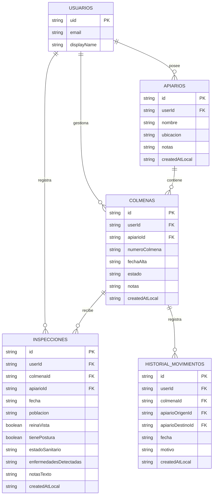

# TRABAJO FINAL INTEGRADOR

# 🐝 BeeKeep: Sistema Inteligente de Gestión Apícola Offline-First

## 📝 Descripción del Proyecto

**BeeKeep** es una Aplicación Web Progresiva (PWA) diseñada específicamente para apicultores que necesitan llevar un control operativo, sanitario y productivo de sus colmenares directamente en el campo. El proyecto resuelve la falta crítica de conectividad en zonas rurales mediante una arquitectura *Offline-First* nativa.

A diferencia de los registros tradicionales en papel que se deterioran o pierden, o de las aplicaciones convencionales que dependen de conexión continua, **BeeKeep** permite registrar inspecciones, altas de colmenas y traslados de forma inmediata en el dispositivo. La información se persiste localmente en IndexedDB y se sincroniza automáticamente con la nube (Cloud Firestore) cuando el dispositivo recupera señal de red.

---

## 🎯 Alcance y Decisiones de Arquitectura

A partir del análisis de requerimientos del dominio y las validaciones de arquitectura:

1. **Modelo Operativo Mono-Dispositivo**: Para la fase inicial, cada apicultor opera con un único dispositivo en campo por cuenta de usuario. Esto simplifica la sincronización evitando complejidades de concurrencia distribuida innecesarias.
2. **Diseño Inmutable / Append-Only**: Las inspecciones y los traslados de colmenas se registran como eventos históricos fechados con identificador único (UUID local). No se sobreescribe información pasada, lo que elimina condiciones de carrera y preserva la trazabilidad.
3. **Rol de los UUIDs**: Los identificadores generados localmente garantizan unicidad e idempotencia. Cada registro local posee una clave unívoca antes de llegar a la nube, asegurando que ante reintentos de red no se dupliquen documentos en la base central.
4. **Propiedad de Datos y Seguridad**: Cada apiario, colmena e inspección está asociado a un `userId`. Las consultas y reglas de seguridad aíslan completamente los datos y coordenadas geográficas de cada apicultor.
5. **Estandarización del Dominio**: Se adopta formalmente la terminología **Apiario** (descartando "lote") y **Colmena**.
6. **Entrada de Datos en Campo**: La búsqueda e ingreso manual por código visible de colmena es el mecanismo principal garantizado. El escaneo QR y el reconocimiento de voz se mantienen como complementos modulares (P1).

---

## 🛠️ Stack Tecnológico

El stack seleccionado minimiza el riesgo de desarrollo, elimina discrepancias de mapeo relacional y aprovecha la persistencia local nativa del estándar Web:

*   **Frontend**: [Lit 3](https://lit.dev/) (Web Components reactivos y ligeros) + [TypeScript](https://www.typescriptlang.org/) + [Vite](https://vitejs.dev/).
*   **Diseño & UI**: [Web Awesome](https://www.webawesome.com/) (Componentes accesibles).
*   **Persistencia Local y Sincronización**: [Firebase Firestore Web SDK v12](https://firebase.google.com/docs/firestore) con `persistentLocalCache` y `persistentMultipleTabManager` sobre **IndexedDB**.
*   **Autenticación**: Firebase Auth para identificación y aislamiento por `userId`.

---

### 🔄 Flujo de Sincronización Offline-First

```text
[ Interfaz de Usuario (Lit Components) ]
                   │
                   ▼
[ Controladores & Servicios (FirestoreService's) ]
                   │
                   ▼
┌──────────────────────────────────────────────────────────────────┐
│              Firebase Firestore SDK (IndexedDB Cache)             │
│   - Persistencia local inmediata con UUID local                 │
│   - Detección de conectividad (Online / Offline)                 │
│   - Cola de mutaciones pendientes (hasPendingWrites)             │
└──────────────────┬───────────────────────────────────────────────┘
                   │
         ¿Conexión disponible?
        ├── NO ──> Operación confirmada localmente en IndexedDB
        └── SÍ ──> Sincronización automática/manual ──> [ Cloud Firestore ]
```

---

## 📊 Diagrama de Entidad-Relación (DER)



---

## 🗂️ Estructura del Proyecto

```text
src/
├── assets/                    # Hojas de estilo y recursos gráficos
│   └── main.css
├── config/                    # Configuración e inicialización de SDKs
│   └── firebase.ts            # Firestore con IndexedDB persistence + Auth
├── constants/                 # Constantes globales y rutas de navegación
│   └── index.ts
├── controllers/               # Controladores reactivos Lit para suscripciones
│   └── firestore-controller.ts
├── models/                    # Definiciones de TypeScript e interfaces de dominio
│   ├── apiario.model.ts
│   ├── colmena.model.ts
│   ├── inspeccion.model.ts
│   └── index.ts
├── services/                  # Capa de datos y operaciones Firestore
│   ├── FirestoreService.ts    # Clase base genérica con filtrado por userId
│   ├── apiario.service.ts
│   ├── colmena.service.ts
│   ├── inspeccion.service.ts
│   └── index.ts
├── views/                     # Vistas y componentes de interfaz
│   ├── components/            # Componentes reutilizables
│   │   ├── apiario-card.ts
│   │   ├── colmena-card.ts
│   │   ├── inspeccion-card.ts
│   │   └── sync-indicator.ts  # Widget de estado de red, pendientes y sync manual
│   ├── apiario/
│   │   └── formulario-apiario.ts
│   ├── colmena/
│   │   └── formulario-colmena.ts
│   ├── inspeccion/
│   │   └── formulario-inspeccion.ts
│   ├── listado/
│   │   └── listado-view.ts
│   └── router.ts              # Enrutador principal de la PWA
├── main.ts                    # Punto de entrada y registro de Web Components
└── vite-env.d.ts
```

---

## 👥 Integrantes del Equipo

*   **Nahuel Urciuolli Zabala** — GitHub: [@NahuelZa](https://github.com/NahuelZa)
*   **Luciano Joaquín Martínez** — GitHub: [@lucianomartinez27](https://github.com/lucianomartinez27)
*   **Santiago Rodriguez** — GitHub: [@Santi-R97](https://github.com/Santi-R97)
